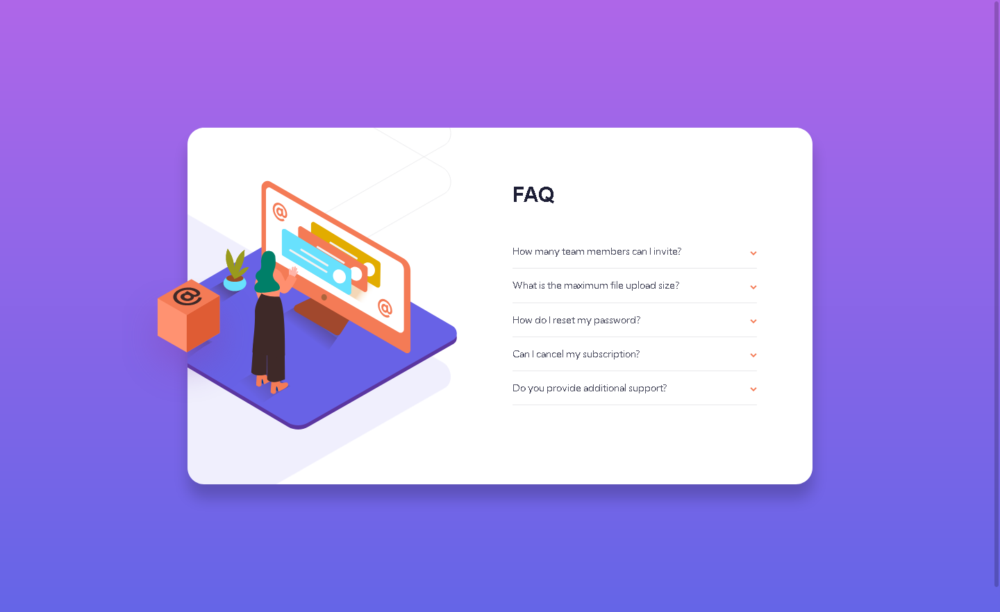

# Frontend Mentor - FAQ accordion card solution

This is a solution to the [FAQ accordion card challenge on Frontend Mentor](https://www.frontendmentor.io/challenges/faq-accordion-card-XlyjD0Oam). Frontend Mentor challenges help you improve your coding skills by building realistic projects.  

## Table of contents

- [Frontend Mentor - FAQ accordion card solution](#frontend-mentor---faq-accordion-card-solution)
  - [Table of contents](#table-of-contents)
  - [Overview](#overview)
    - [The challenge](#the-challenge)
    - [Screenshot](#screenshot)
    - [Links](#links)
  - [My process](#my-process)
    - [Built with](#built-with)
    - [What I learned](#what-i-learned)
  - [Author](#author)

## Overview

### The challenge

Users should be able to:

- View the optimal layout for the component depending on their device's screen size
- See hover states for all interactive elements on the page
- Hide/Show the answer to a question when the question is clicked
### Screenshot

### Links

- Live Site URL: [https://0x41-li.github.io/faq-accordion-card/](https://0x41-li.github.io/faq-accordion-card/).

## My process

### Built with

- Semantic HTML5 markup
- Flexbox
- Mobile-first workflow
- Sass
### What I learned

I enhanced my knowledge on flexbox, and responsive design, transitions, Sass, accordion, Sass, JavaScript, Accessibility.

## Author

- Frontend Mentor - [@0x41-li](https://www.frontendmentor.io/profile/0x41-li)
- Twitter - [@0AliSbane2](https://www.twitter.com/yourusername)

